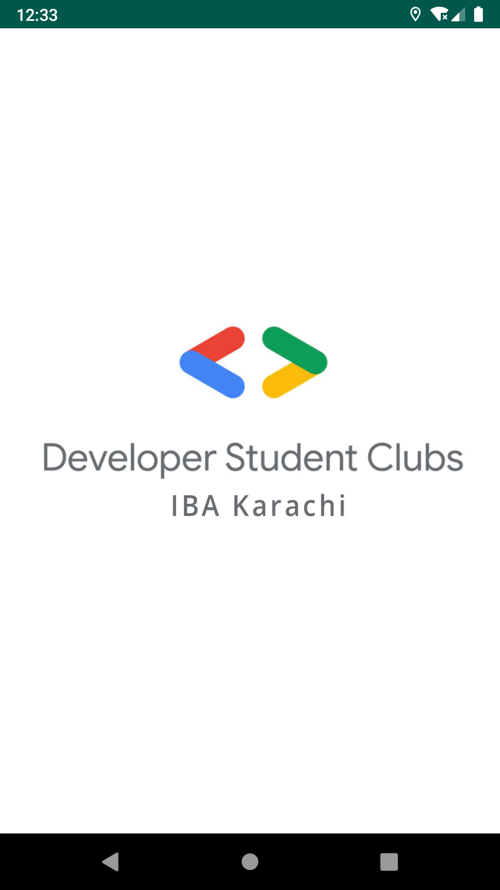
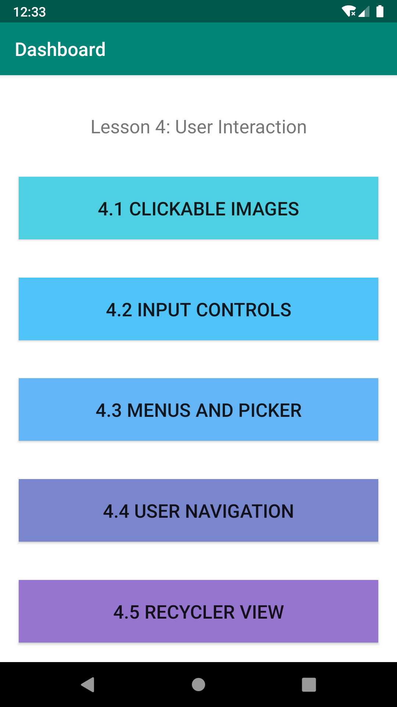

# UserInteractionDevCamp
This project is for Android DevCamp Unit 2: User Experience, Lesson 4: User Interaction

[Article Link](https://medium.com/@hamzaahmedkhan/android-user-interaction-215004476887) 
[Slides Link](https://docs.google.com/presentation/d/1euBgVZkBx5YnlQpC6mQqEfu05J3ecbMXGozNkBawnhI/edit#slide=id.g6d2a5c9ae1_0_139)

           


## Unit 2 - Lesson: 4 User Interaction
We can follow Android Fundamental Training Unit 2 - Lesson: 4 User Interaction


https://developer.android.com/courses/fundamentals-training/toc-v2#unit_2_user_experience
 

This lesson consists of 5 codelabs

[4.1: Clickable images](https://codelabs.developers.google.com/codelabs/android-training-clickable-images/index.html?index=..%2F..%2Fandroid-training#0)

[4.2: Input controls](https://codelabs.developers.google.com/codelabs/android-training-input-controls/index.html?index=..%2F..%2Fandroid-training#0)

[4.3: Menus and pickers](https://codelabs.developers.google.com/codelabs/android-training-menus-and-pickers/index.html?index=..%2F..%2Fandroid-training#0)

[4.4: User navigation](https://codelabs.developers.google.com/codelabs/android-training-provide-user-navigation/index.html?index=..%2F..%2Fandroid-training#0)

[4.5: RecyclerView](https://codelabs.developers.google.com/codelabs/android-training-create-recycler-view/index.html?index=..%2F..%2Fandroid-training#0)


## SOLVE TODOS


### 4.1: Clickable images

What you'll learn
- How to use an image as an interactive element to perform an action.
- How to set attributes for ImageView elements in the layout editor.
- How to add an onClick() method to display a Toast message.

What you'll do
- Create a new Android Studio project for a mock dessert-ordering app that uses images as interactive elements.
- Set onClick() handlers for the images to display different Toast messages.
- Change the floating action button supplied by the template so that it shows a different icon and launches another Activity.


### 4.2: Input controls

What you'll learn
- How to change the input methods to enable suggestions, auto-capitalization, and password obfuscation.
- How to change the generic on-screen keyboard to a phone keypad or other specialized keyboards.
- How to add radio buttons for the user to select one item from a set of items.
- How to add a spinner to show a drop-down menu with values, from which the user can select one.
    
What you'll do
- Show a keyboard for entering an email address.
- Show a numeric keypad for entering phone numbers.
- Allow multiple-line text entry with automatic sentence capitalization.
- Add radio buttons for selecting an option.
- Set an onClick handler for the radio buttons.
- Add a spinner for the phone number field for selecting one value from a set of values.


### 4.3: Menus and pickers

What you'll learn
- How to add menu items to the options menu.
- How to add icons for items in the options menu.
- How to set menu items to show in the app bar.
- How to add click handlers for menu items.
- How to add a dialog for an alert.
- How to add the date picker.

What you'll do
- Continue adding features to the Droid Cafe project from the previous practical.
- Add menu items to the options menu.
- Add icons for menu items to appear in the app bar.
- Connect menu-item clicks to event handlers that process the click events.
- Use an alert dialog to request a user's choice.
- Use a date picker for date input.


### 4.4: User navigation

What you'll learn
- How to add the Up button to the app bar.
- How to set up an app with tab navigation and swipe views.

What you'll do
- Continue adding features to the Droid Cafe project from the previous practical.
- Provide the Up button in the app bar to navigate up to the parent Activity.
- Create a new app with tabs for navigating Activity screens that can also be swiped.


### 4.5: RecyclerView

What you'll learn
- How to use the RecyclerView class to display items in a scrollable list.
- How to dynamically add items to the RecyclerView as they become visible through scrolling.
- How to perform an action when the user taps a specific item.
- How to show a FAB and perform an action when the user taps it.

What you'll do
- Create a new app that uses a RecyclerView to display a list of items as a scrollable list and associate click behavior with the list items.
- Use a FAB to let the user add items to the RecyclerView.


#### Create separate activity for each Task.

```java
    btnClickableImages.setOnClickListener(new View.OnClickListener() {
            @Override
            public void onClick(View view) {
                // TODO: 2020-01-06 Replace this Toast with Clickable Images lesson
                Toast.makeText(DashboardActivity.this, "This is Clickable images", Toast.LENGTH_SHORT).show();
            }
        });

        btnInputControls.setOnClickListener(new View.OnClickListener() {
            @Override
            public void onClick(View view) {
                // TODO: 2020-01-06 Replace this Toast with Input Control lesson
                Toast.makeText(DashboardActivity.this, "This is input controls", Toast.LENGTH_SHORT).show();
            }
        });

        btnMenusAndPickers.setOnClickListener(new View.OnClickListener() {
            @Override
            public void onClick(View view) {
                // TODO: 2020-01-06 Replace this Toast with Menus and Pickers lesson
                Toast.makeText(DashboardActivity.this, "This is Menus And Pickers", Toast.LENGTH_SHORT).show();

            }
        });

        btnUserNavigation.setOnClickListener(new View.OnClickListener() {
            @Override
            public void onClick(View view) {
                // TODO: 2020-01-06 Replace this Toast with User Navigation lesson
                Toast.makeText(DashboardActivity.this, "This is User Navigation", Toast.LENGTH_SHORT).show();
            }
        });

        btnRecyclerView.setOnClickListener(new View.OnClickListener() {
            @Override
            public void onClick(View view) {
                // TODO: 2020-01-06 Replace this Toast with Recycler View lesson
                Toast.makeText(DashboardActivity.this, "This is User Recycler View", Toast.LENGTH_SHORT).show();
                
            }
        });
```
